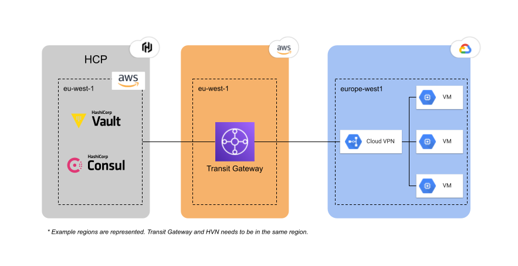

# Connect GCP VMs to HCP through AWS Transit Gateways with Terraform
This repo contains the Terraform code to configure a demo environment with the networking configuration between Google Cloud and a [HashiCorp HVN](https://developer.hashicorp.com/hcp/docs/hcp/network) network in AWS. This is required if you want to connect Vault or Consul clients to the private server endpoints running in HCP (no public URLs to your Vault or Consul clusters).



## Requirements

* AWS account
* GCP project owner permissions
* HCP Credentials
  * Just create your environment variables `HCP_CLIENT_ID` and `HCP_CLIENT_SECRET` from the terminal you will execute the Terraform
* [Create an HVN network](https://developer.hashicorp.com/hcp/docs/hcp/network/hvn-aws/hvn-aws#create-an-hvn) in AWS in the HCP platform
* Terraform CLI


## Deploy
This repo has the Terraform code to deploy:
* GCP instance(s) with a new GCP network and subnets
* AWS Transit Gateway to connect to [HashiCorp HVN](https://developer.hashicorp.com/hcp/docs/hcp/network) and its Site-to-Site VPN configuration 
* GCP Cloud VPN requred config to route and connect to the AWS Transit Gateway (GCP gateways, tunnels and routers)
* HCP Transit Gateway attachment and routes for the HCP Portal

Create your variables file:
```
tee terraform.auto.tfvars << EOF
vpc_id = "<aws_vpc_id>"
hvn_id = "<hvn_id>"
gcp_project = "<gcp_project_id>"

nodes = 1
owner = "dcanadillas"
cluster = "dc-cluster"
EOF
```

> NOTE: If you have already your Vault or Consul cluster running in the HVN network you can use `vault_cluster` or `consul_cluster` Terraform variables to get the outputs in Terraform to configure your clients (private endpoints or Consul configuration files to configure clients)

Deploy with Terraform:
```
terraform init

terraform apply
```

## Test connectivity

To test that the configuration is working you can try to connect from your GCP VMs to your Vault or Consul private link.

You can connect to your GCP VMs by ssh using `gcloud` and the Terraform outputs from the previous execution (you need to be connected to your GCP project with the `gcloud config set project <gcp_project_id>`):
```
$(terraform output -json gcp_vms | jq -r .[0])
```

Once you are in the GCP VM terminal, you just can do a `curl` request to check that you can connect to the private endpoint. Here is an example of the execution of the command from a GCP VM:
```
david@vm-client-0:~$ curl -LI $HCP_VAULT_ADDR_PRIVATE
HTTP/2 307
cache-control: no-store
content-type: text/html; charset=utf-8
location: /ui/
strict-transport-security: max-age=31536000; includeSubDomains
date: Fri, 19 Jan 2024 11:10:58 GMT

HTTP/2 200
accept-ranges: bytes
cache-control: no-store
content-security-policy: default-src 'none'; connect-src 'self'; img-src 'self' data:; script-src 'self'; style-src 'unsafe-inline' 'self'; form-action  'none'; frame-ancestors 'none'; font-src 'self'
content-type: text/html; charset=utf-8
service-worker-allowed: /
strict-transport-security: max-age=31536000; includeSubDomains
vary: Accept-Encoding
x-content-type-options: nosniff
content-length: 805208
date: Fri, 19 Jan 2024 11:10:58 GMT
```